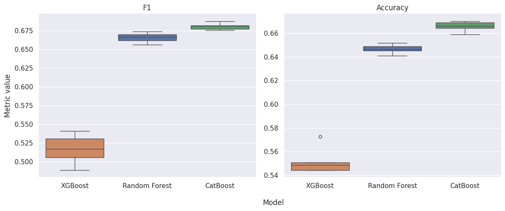

# Decoding the Bottle

**What can a wine’s price, origin, grapes, and taste profile tell us about its public rating?**

A project for the **Data Science, Learning and Applications (DALAS)** course by **Ekaterina Bogush** and **Amélie Chu**. We collected wine data from Vivino and SimpleWine, explored its biases, imputed missing values, compared tree-based models, and explained their predictions with SHAP.

Our target is **public perception expressed in ratings**, rather than an objective measure of wine quality. We also studied whether a wine is rated above the average of wines in a similar price range.

**Start with the [full report](reports/DALAS_wine_project.pdf), [results summary](docs/results.md), or [modeling notebook](notebooks/04_models_and_explanations.ipynb).**

**[Explore the wines on Decoding the Bottle](https://decodingthebottle.ekat.world/)**: browse 9,329 held-out wines, compare public ratings with model predictions, and open each bottle’s SHAP explanation. The website uses a separately retrained model; see the [website guide](web/README.md) for details.

## Recorded results

CatBoost performed best among the tested Random Forest, XGBoost, and CatBoost configurations.

| Task | Held-out test performance | Interpretation |
| --- | --- | --- |
| Predict mean public rating | MAE **0.163 stars**, MSE **0.0593**, R² **0.553** | Predicts the observed rating on a 1–5 scale, with price included |
| Predict above-average rating within a price range | F1 **0.684**, accuracy **66.7%** | Predicts the sign of a price-adjusted rating, with price excluded from the model inputs |

These are **historical results**, verified against the report and saved notebook outputs, not newly trained models. The repository includes code, recorded notebook outputs, and the report. The original datasets and fitted models are not included in Git. A prepared table has since been recovered locally for a separate website model; some preparation steps remain missing for an exact historical reproduction. See [reproducibility](docs/reproducibility.md).



Price was the strongest driver of the rating model. Origin, vintage, wine type, winery, and alcohol also contributed. These relationships describe the fitted model and this dataset; they do not demonstrate that changing a feature causes better wine.

## Project map

```text
notebooks/                  Numbered research notebooks, with recorded outputs
src/wine_quality/           Reusable preprocessing, translation, and imputation
scraping/                   SimpleWine Scrapy project and Vivino API collectors
data/raw/                   Original collections, kept locally
data/interim/               Parsed, harmonized, and merged tables, kept locally
data/processed/             Analysis and modeling inputs, kept locally
reports/                    Course report and selected historical figures
artifacts/                  New generated figures and future model exports
docs/                       Results, reproduction guide, and website assessment
web/                        Static explorer of 9,329 held-out test wines
scripts/check_project.py    Offline structural and results-provenance checks
tests/                      Focused checks for corrected execution issues
```

The original `scripts/` helpers now live in the importable `wine_quality` package. `scrapping/` is now `scraping/`. See [the migration guide](docs/reproducibility.md#migration-from-the-original-layout) for data paths.

## Setup

Use Python **3.11 or 3.12**. The lockfile records a new environment for this reorganized project; it does not recover the original course environment.

With [uv](https://docs.astral.sh/uv/):

```bash
uv sync --all-extras
uv run python scripts/check_project.py
uv run python -m unittest discover -s tests
uv run jupyter lab
```

Or with pip, using a Python 3.12 interpreter:

```bash
python3.12 -m venv .venv
source .venv/bin/activate
python -m pip install -e '.[analysis,scraping,dev]'
python scripts/check_project.py
python -m unittest discover -s tests
jupyter lab
```

For only the notebooks, install the `analysis` extra. Scraping additionally needs the `scraping` extra and `python -m playwright install chromium`. [Collection instructions](scraping/README.md) describe each collector and its inputs.

On macOS, XGBoost also requires the OpenMP runtime: `brew install libomp`.

## Reading and rerunning

1. [Parse Vivino](notebooks/01_parse_vivino.ipynb): normalize the original API responses into tables.
2. Restore the historical cross-source merge and normalization outputs described in [the data guide](data/README.md). Their complete producer is not present in this checkout.
3. [Imputation](notebooks/02_imputation.ipynb): inspect missingness and the imputation strategy.
4. [Exploratory analysis](notebooks/03_exploratory_analysis.ipynb): explore the historical inferred dataset.
5. [Models and explanations](notebooks/04_models_and_explanations.ipynb): compare models and inspect their explanations.

The numbering is a reading order, not a claim that executing all four notebooks builds the missing datasets. To check whether the expected input files are available, run `python scripts/check_project.py --require-data`. Scraping is a separate, explicit activity; neither verification nor notebook setup makes network requests to the wine websites.
