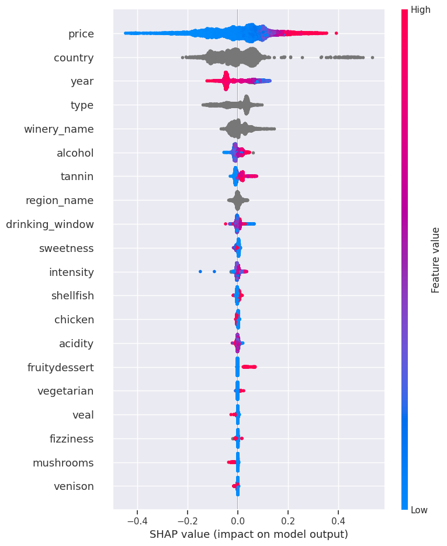

# Results and interpretation

## What was predicted?

The first task predicts the mean public rating of a wine on a 1–5 scale. The second asks whether a wine is rated at or above the mean of its training-derived price bin. These are measures of observed public ratings, not blind-tasting quality or individual preference.

For the second task, the original implementation fits a **regressor to the adjusted rating**, then assigns class 1 when its prediction is at least zero. It is not a separately fitted CatBoostClassifier, and its output is not a calibrated probability.

## Sources

- [Report](../reports/DALAS_wine_project.pdf): Sections 6.3–6.4, Tables 3–4 (pages 19 and 22), and Section 7 (pages 23–27).
- [Modeling notebook](../notebooks/04_models_and_explanations.ipynb): saved outputs of the held-out CatBoost evaluations.
- [Machine-readable results](../reports/results.json): exact saved metric values and source-cell identifiers for a future frontend.

No training was rerun during repository organization. The report uses rounded values; the JSON preserves the saved notebook precision.

## Held-out CatBoost performance

| Rating regression | Train | Test |
| --- | ---: | ---: |
| MAE | 0.157118 | 0.162635 |
| MSE | 0.055829 | 0.059282 |
| R² | 0.588144 | 0.552575 |

An MAE of 0.163 means an average absolute error of roughly 0.16 stars on this test set. It is not an error bound for each bottle. Predictions tend to miss the extremes: low ratings are overestimated and very high ratings underestimated.

| Price-relative task | Train | Test |
| --- | ---: | ---: |
| Precision | 0.744493 | 0.700769 |
| Recall | 0.719346 | 0.668916 |
| F1 | 0.731704 | 0.684472 |
| Accuracy | 0.717057 | 0.666953 |

The adjusted-rating regressor behind this task has test MAE 0.167641, MSE 0.061185, and R² 0.184946. Its moderate classification performance supports an exploratory “above average for its price” demo, with uncertainty made clear.

Both experiments use an 80/20 split stratified by country, with random state 42, and five-fold validation on the training subset. Saved modeling outputs show **37,315 train rows and 9,329 test rows**. The report describes roughly 45,000 collected wines; the exact accounting that leads to 46,644 modeling rows needs reconciliation once the historical datasets are recovered.

The CatBoost configuration uses 500 iterations, learning rate 0.05, depth 6, RMSE loss, and random state 0. Model comparisons use the configurations recorded in the notebook; “best” applies to those experiments.

## What influenced the prediction?

The report’s SHAP analysis places **price** first for public-rating prediction, followed by features including **country, vintage, type, winery, and alcohol**. Higher prices and older vintages generally shift predicted ratings upward in the reported analysis. Taste effects depend on context: tannins tend to increase predictions, while sweetness often lowers them in the rating model.

The price-relative experiment removes price from its input features. Geography, vintage, alcohol, wine type, and taste still contribute. Food and grape indicators can influence individual cases, but sparse categories need cautious interpretation.

The report’s regression and price-relative figures describe different fitted models. The notebook originally required manually switching models; the reorganized notebook now exposes that selection explicitly. Historical figures retain their original contents and should be regenerated with task labels before being used as authoritative exports for a website.

## Limits on the claims

- The data shows a price–rating association. It does not isolate the causal effect of price expectations from unobserved quality, reputation, or selection effects.
- Subtracting price-bin means changes the prediction target; it does not prove that all price bias has been removed.
- The split is by row, not by parent wine or winery. Related vintages may occur on both sides; performance on entirely unseen producers needs a grouped evaluation.
- The complete upstream preparation is absent. Its relationship to the train/test split must be audited, including whether imputation used information across that split.
- Country, region, winery, and wine-type coverage is uneven. Strong effects for rare categories may not generalize.
- Public ratings are not recommendations personalized to a visitor’s taste.
- The exact original dependency versions, model artifacts, encoders, and training-derived price-bin metadata were not saved here.

These limitations are part of the project story and should accompany any public demonstration.
